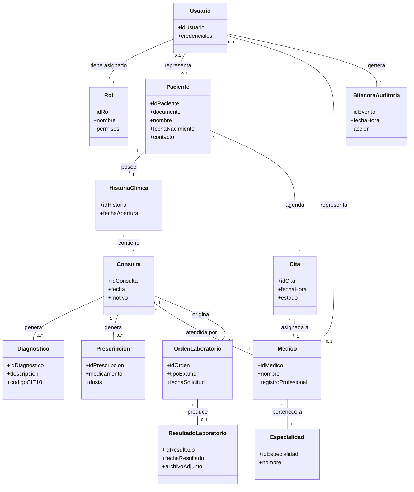
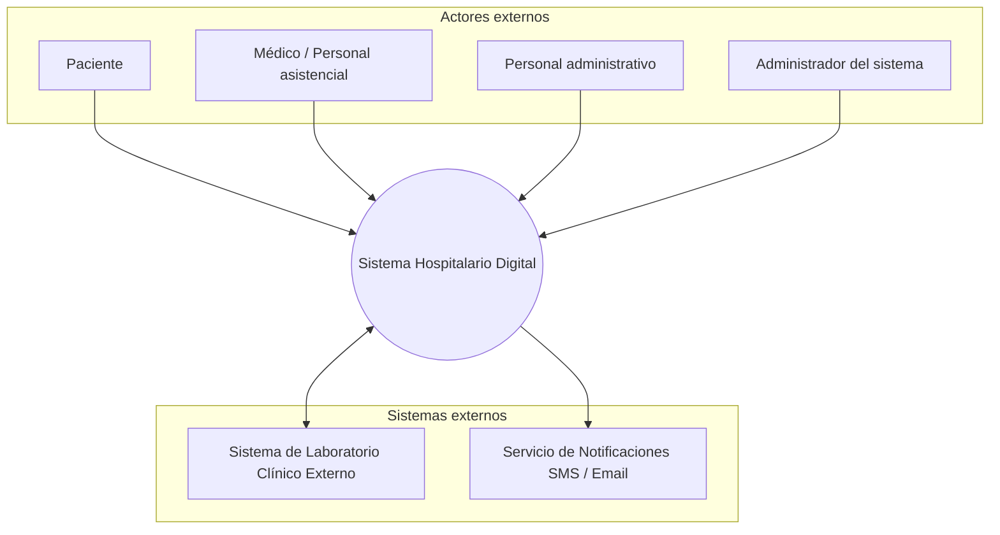
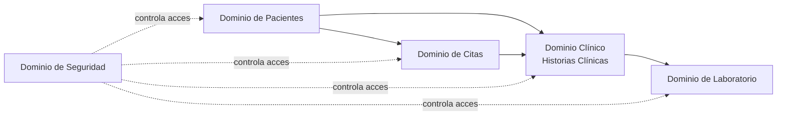
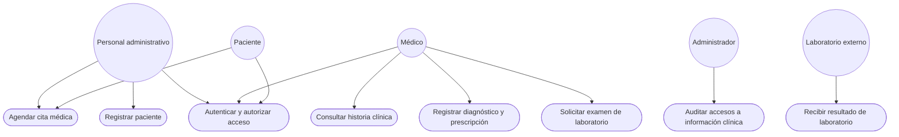
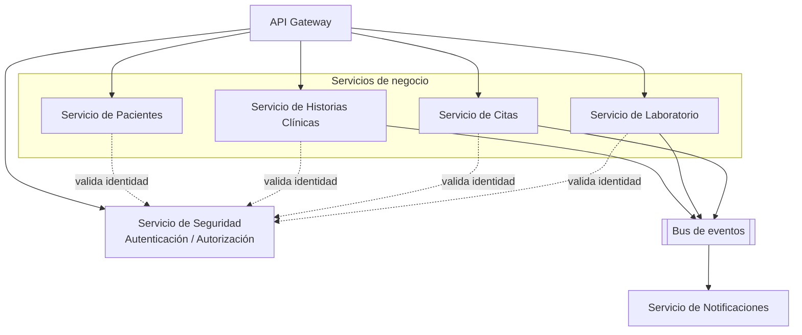
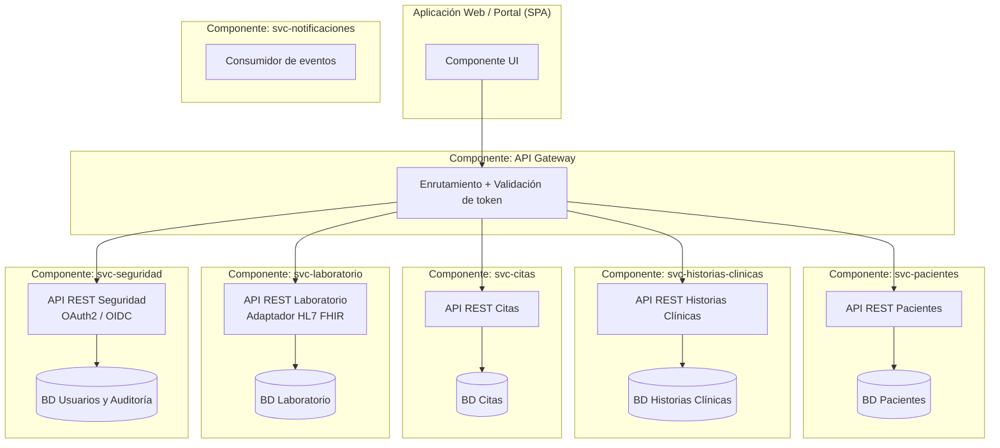
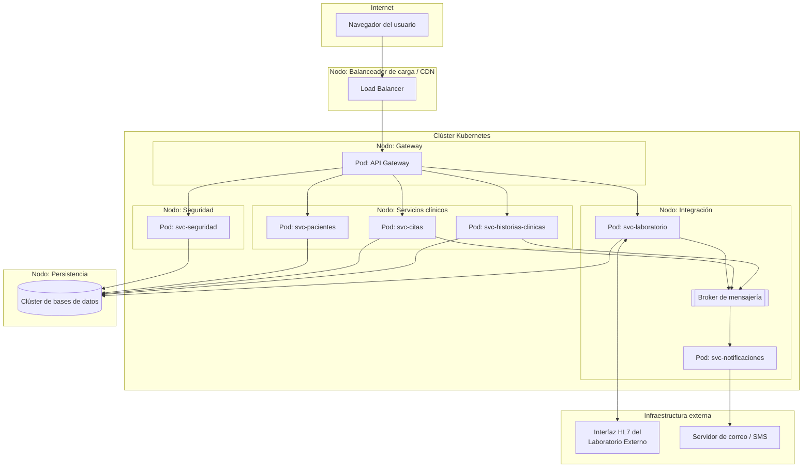

# Documento de Especificación Arquitectónica de Software (SAD)
## Sistema Hospitalario Digital

**Metodología:** Rational Unified Process (RUP)
**Modelo de vistas:** Modelo 4+1 de Kruchten
**Versión:** 1.0
**Fecha:** Agosto de 2026
**Equipo de trabajo:** _[Nombre del equipo / Integrantes]_
**Asignatura:** Arquitectura del Software

---

## Tabla de contenido

1. [Introducción](#1-introducción)
2. [Documento de visión](#2-documento-de-visión)
3. [Especificación de requisitos](#3-especificación-de-requisitos)
4. [Modelo conceptual del dominio](#4-modelo-conceptual-del-dominio)
5. [Decisiones arquitectónicas](#5-decisiones-arquitectónicas)
6. [Vistas arquitectónicas](#6-vistas-arquitectónicas)
   - [6.1 Vista de contexto](#61-vista-de-contexto)
   - [6.2 Vista conceptual](#62-vista-conceptual)
   - [6.3 Vista de casos de uso](#63-vista-de-casos-de-uso)
   - [6.4 Vista lógica](#64-vista-lógica)
   - [6.5 Vista de implementación](#65-vista-de-implementación)
   - [6.6 Vista física (despliegue)](#66-vista-física-despliegue)
7. [Conclusiones](#7-conclusiones)
8. [Referencias bibliográficas](#8-referencias-bibliográficas)

---

## 1. Introducción

El presente documento constituye la **Especificación Arquitectónica de Software (Software Architecture Document — SAD)** del caso de estudio *Sistema Hospitalario Digital*. Su propósito es describir, justificar y representar la arquitectura de software propuesta para dar soporte a los procesos de gestión de pacientes, historias clínicas, citas médicas, integración con laboratorios, y seguridad y confidencialidad de la información clínica de una institución de salud.

El documento se ha elaborado siguiendo los lineamientos del **Rational Unified Process (RUP)**, de manera incremental a lo largo de cuatro fases (visión y requisitos; modelo de dominio y decisiones arquitectónicas; vistas arquitectónicas; consolidación), y organiza la representación arquitectónica según el **modelo 4+1 de Philippe Kruchten**, el cual describe la arquitectura desde cinco perspectivas concurrentes (lógica, de implementación, de procesos, de despliegue y de casos de uso), complementadas aquí con las vistas de contexto y conceptual solicitadas para este proyecto.

El documento está dirigido a los integrantes del equipo de desarrollo, a los evaluadores académicos y a cualquier colaborador técnico que consulte el repositorio de GitHub, con el fin de comprender el problema abordado, las decisiones arquitectónicas adoptadas y la manera en que la arquitectura propuesta satisface los atributos de calidad requeridos por el sistema.

---

## 2. Documento de visión

### 2.1 Descripción del problema

Las instituciones de salud de mediana y alta complejidad gestionan actualmente procesos críticos —registro de pacientes, historias clínicas, agendamiento de citas, órdenes y resultados de laboratorio— mediante sistemas heterogéneos, procesos manuales o soluciones aisladas que no se comunican entre sí. Esto genera duplicidad de información, demoras en la atención, dificultad para consultar el historial clínico completo de un paciente, riesgo de errores médicos por información incompleta y vulnerabilidades en el manejo de datos sensibles de salud.

Se requiere una plataforma digital integrada que centralice la gestión clínica y administrativa del hospital, garantice la disponibilidad y trazabilidad de la información, se interconecte con laboratorios externos y cumpla con los más altos estándares de seguridad y confidencialidad exigidos por la normativa de protección de datos en salud.

### 2.2 Objetivos del sistema

- Centralizar el registro y la consulta de información de pacientes y sus historias clínicas.
- Optimizar el proceso de agendamiento, confirmación y seguimiento de citas médicas.
- Integrar de forma segura los resultados de laboratorios externos con la historia clínica del paciente.
- Garantizar la confidencialidad, integridad y disponibilidad de la información clínica mediante mecanismos de seguridad robustos y control de acceso basado en roles.
- Proveer trazabilidad y auditoría de todos los accesos y modificaciones sobre la información clínica.
- Facilitar la interoperabilidad con otros sistemas de salud mediante estándares reconocidos (HL7/FHIR).

### 2.3 Alcance

El sistema cubrirá los procesos de: registro y administración de pacientes; creación, consulta y actualización de historias clínicas; gestión de citas médicas (agendamiento, reprogramación, cancelación); solicitud y recepción de órdenes y resultados de laboratorio mediante integración con sistemas externos; y administración de usuarios, roles y permisos con auditoría de accesos.

Quedan fuera del alcance de esta primera versión: la facturación y liquidación con aseguradoras (EPS), la gestión de inventario de farmacia y suministros, y la telemedicina (consulta remota por videollamada), los cuales se identifican como posibles extensiones futuras.

### 2.4 Stakeholders

| Stakeholder | Rol / Interés |
|---|---|
| Paciente | Usuario final que recibe atención y consulta su información clínica |
| Médico / Personal asistencial | Registra diagnósticos, prescripciones y consulta historias clínicas |
| Personal administrativo | Gestiona el registro de pacientes y el agendamiento de citas |
| Laboratorio clínico externo | Sistema externo que recibe órdenes y envía resultados de exámenes |
| Administrador del sistema | Gestiona usuarios, roles, permisos y parámetros del sistema |
| Área de seguridad de la información / Oficial de cumplimiento | Vela por el cumplimiento normativo de protección de datos de salud |
| Dirección del hospital (patrocinador) | Define objetivos estratégicos y aprueba el proyecto |
| Equipo de desarrollo | Diseña, construye y mantiene el sistema |

### 2.5 Identificación de los módulos funcionales

1. **Gestión de pacientes** — registro, actualización y consulta de datos demográficos y administrativos del paciente.
2. **Historias clínicas** — creación, consulta y actualización de la información clínica (diagnósticos, evoluciones, prescripciones).
3. **Citas médicas** — agendamiento, reprogramación, cancelación y confirmación de citas.
4. **Integración con laboratorios** — envío de órdenes de examen y recepción de resultados desde laboratorios externos.
5. **Seguridad y confidencialidad de la información** — autenticación, autorización basada en roles, cifrado y auditoría de accesos.

---

## 3. Especificación de requisitos

### 3.1 Requisitos funcionales por módulo

#### Módulo: Gestión de pacientes

| ID | Requisito |
|---|---|
| RF-01 | El sistema debe permitir registrar un nuevo paciente con sus datos demográficos y de contacto. |
| RF-02 | El sistema debe permitir buscar y consultar pacientes por documento de identidad, nombre o número de registro. |
| RF-03 | El sistema debe permitir actualizar los datos administrativos de un paciente existente. |
| RF-04 | El sistema debe validar que no se registren pacientes duplicados con el mismo documento de identidad. |

#### Módulo: Historias clínicas

| ID | Requisito |
|---|---|
| RF-05 | El sistema debe permitir a un médico crear una entrada de historia clínica asociada a una consulta. |
| RF-06 | El sistema debe permitir consultar el historial clínico completo de un paciente en orden cronológico. |
| RF-07 | El sistema debe permitir registrar diagnósticos y prescripciones asociados a una consulta. |
| RF-08 | El sistema debe impedir la eliminación física de registros clínicos, permitiendo únicamente anulaciones controladas y trazables. |

#### Módulo: Citas médicas

| ID | Requisito |
|---|---|
| RF-09 | El sistema debe permitir agendar una cita médica seleccionando especialidad, médico y horario disponible. |
| RF-10 | El sistema debe permitir reprogramar o cancelar una cita existente. |
| RF-11 | El sistema debe notificar al paciente la confirmación, reprogramación o cancelación de una cita. |
| RF-12 | El sistema debe evitar la doble asignación de un mismo horario a un médico. |

#### Módulo: Integración con laboratorios

| ID | Requisito |
|---|---|
| RF-13 | El sistema debe permitir generar y enviar una orden de examen de laboratorio asociada a un paciente. |
| RF-14 | El sistema debe recibir de forma automática los resultados de laboratorio desde el sistema externo. |
| RF-15 | El sistema debe asociar automáticamente el resultado recibido con la orden y la historia clínica correspondiente. |
| RF-16 | El sistema debe notificar al médico tratante cuando un resultado de laboratorio esté disponible. |

#### Módulo: Seguridad y confidencialidad de la información

| ID | Requisito |
|---|---|
| RF-17 | El sistema debe autenticar a los usuarios mediante usuario y contraseña, con soporte para autenticación multifactor. |
| RF-18 | El sistema debe autorizar el acceso a la información según el rol del usuario (paciente, médico, administrativo, administrador). |
| RF-19 | El sistema debe registrar en una bitácora de auditoría todo acceso o modificación a la información clínica. |
| RF-20 | El sistema debe cifrar la información clínica sensible tanto en tránsito como en reposo. |

### 3.2 Requisitos no funcionales (atributos de calidad)

| ID | Atributo | Requisito |
|---|---|---|
| RNF-01 | Seguridad | Toda comunicación entre componentes y con sistemas externos debe cifrarse mediante TLS 1.2 o superior. |
| RNF-02 | Confidencialidad | El acceso a la historia clínica debe restringirse estrictamente al personal autorizado, conforme al principio de mínimo privilegio. |
| RNF-03 | Disponibilidad | El sistema debe garantizar una disponibilidad mínima del 99.5% para los módulos clínicos y de citas. |
| RNF-04 | Rendimiento | Las consultas de historia clínica deben responder en menos de 2 segundos bajo condiciones normales de carga. |
| RNF-05 | Escalabilidad | El sistema debe soportar el incremento de usuarios y volumen de historias clínicas sin degradar el rendimiento, mediante escalamiento horizontal de los servicios. |
| RNF-06 | Interoperabilidad | La integración con laboratorios y otros sistemas de salud debe soportar el estándar HL7 FHIR. |
| RNF-07 | Auditabilidad | Todos los eventos de acceso a datos clínicos deben quedar registrados de forma inmutable y trazable. |
| RNF-08 | Usabilidad | Las interfaces destinadas al personal asistencial deben permitir registrar una consulta en no más de 5 pasos. |
| RNF-09 | Mantenibilidad | Cada módulo funcional debe poder desplegarse y actualizarse de forma independiente, sin afectar a los demás. |
| RNF-10 | Portabilidad | El sistema debe poder desplegarse en contenedores, permitiendo su ejecución en distintos proveedores de infraestructura. |

### 3.3 Restricciones técnicas y organizacionales

- El sistema debe cumplir con la normativa de protección de datos personales y de historia clínica vigente (p. ej., Ley 1581 de 2012 y Resolución 1995 de 1999 en Colombia, o normativa equivalente del país de operación).
- La integración con laboratorios externos debe realizarse mediante interfaces estándar (HL7/FHIR) y no mediante acceso directo a bases de datos de terceros.
- El proyecto debe desarrollarse con tecnologías de código abierto o licenciamiento ya disponible en la institución, para minimizar costos.
- El equipo de desarrollo cuenta con experiencia previa en arquitecturas orientadas a servicios y contenedores, lo que condiciona la selección tecnológica.
- El sistema debe operar bajo un esquema de infraestructura en la nube o híbrida, con respaldo periódico de la información clínica.

---

## 4. Modelo conceptual del dominio

### 4.1 Entidades principales

- **Paciente**: persona natural que recibe atención médica.
- **HistoriaClinica**: expediente que agrupa la información clínica de un paciente.
- **Consulta**: encuentro clínico entre un paciente y un médico, origen de diagnósticos y prescripciones.
- **Diagnostico**: condición clínica identificada en una consulta.
- **Prescripcion**: indicación de medicamento o tratamiento asociada a una consulta.
- **Medico**: profesional de la salud que atiende consultas.
- **Especialidad**: área de conocimiento médico a la que pertenece un médico.
- **Cita**: reserva de un horario de atención entre un paciente y un médico.
- **OrdenLaboratorio**: solicitud de examen de laboratorio derivada de una consulta.
- **ResultadoLaboratorio**: respuesta enviada por el laboratorio externo asociada a una orden.
- **Usuario**: cuenta de acceso al sistema, asociada a una persona (paciente, médico o personal administrativo).
- **Rol**: conjunto de permisos que determina qué acciones puede ejecutar un usuario.
- **BitacoraAuditoria**: registro inmutable de accesos y operaciones sobre información clínica.

### 4.2 Relaciones entre entidades



El modelo evidencia que el **Paciente** es la entidad central del dominio: toda la información clínica (historia, consultas, diagnósticos, prescripciones, órdenes y resultados de laboratorio) gira en torno a él, mientras que **Usuario** y **Rol** desacoplan la identidad de acceso de las entidades de negocio (paciente, médico), permitiendo un control de seguridad independiente del modelo clínico.

---

## 5. Decisiones arquitectónicas

### 5.1 Selección del estilo arquitectónico

Se selecciona una **arquitectura de microservicios**, organizada en torno a los módulos funcionales identificados (Pacientes, Historias Clínicas, Citas, Laboratorio, Seguridad), expuestos a través de un **API Gateway** y complementados con **comunicación asíncrona basada en eventos** para los flujos de integración con laboratorios y notificaciones.

**Justificación:**

- Los módulos funcionales del sistema (Pacientes, Historias Clínicas, Citas, Laboratorio, Seguridad) presentan **bajo acoplamiento funcional** y **ciclos de cambio distintos**, lo cual favorece un despliegue y evolución independientes (RNF-09, Mantenibilidad).
- El requisito de **disponibilidad diferenciada** (RNF-03) exige que una falla en un módulo no crítico (p. ej., laboratorio) no afecte la disponibilidad de módulos críticos (historia clínica, citas); los microservicios permiten aislar fallos.
- El requisito de **escalabilidad** (RNF-05) se satisface mejor escalando de forma independiente los servicios con mayor carga (p. ej., Citas o Historias Clínicas) sin escalar todo el sistema.
- La **integración con laboratorios externos** (RF-13 a RF-16) es naturalmente asíncrona (la respuesta del laboratorio no es inmediata), lo que se ajusta a un modelo de comunicación basado en eventos/mensajería en lugar de llamadas síncronas bloqueantes.
- Un estilo monolítico habría simplificado el desarrollo inicial, pero dificultaría el cumplimiento de RNF-09 y RNF-10 (despliegue independiente y portabilidad), y concentraría el riesgo de seguridad de todos los módulos en un único perímetro.

### 5.2 Registro de decisiones arquitectónicas (ADR)

**ADR-001 — Estilo arquitectónico: Microservicios con API Gateway**
- *Contexto:* módulos con distintos ciclos de vida, criticidad y patrones de carga.
- *Decisión:* adoptar microservicios independientes por módulo funcional, expuestos mediante un API Gateway único.
- *Consecuencias:* mayor complejidad operativa (orquestación, monitoreo distribuido) a cambio de aislamiento de fallos, escalabilidad y despliegue independiente.

**ADR-002 — Persistencia poliglota: base de datos por servicio**
- *Contexto:* cada servicio tiene requisitos de datos distintos (estructurados en Citas y Pacientes, semiestructurados en Historias Clínicas).
- *Decisión:* cada microservicio administra su propia base de datos (database-per-service), evitando acoplamiento a nivel de esquema.
- *Consecuencias:* se requiere consistencia eventual entre servicios; se mitiga con eventos de dominio publicados ante cambios relevantes.

**ADR-003 — Autenticación y autorización centralizadas**
- *Contexto:* RF-17, RF-18 y RNF-02 exigen control de acceso uniforme y confidencialidad estricta.
- *Decisión:* implementar un servicio de Seguridad basado en OAuth 2.0 / OpenID Connect, con control de acceso basado en roles (RBAC), validado por el API Gateway en cada solicitud.
- *Consecuencias:* punto único de verificación de identidad; requiere alta disponibilidad del servicio de Seguridad.

**ADR-004 — Interoperabilidad mediante HL7 FHIR**
- *Contexto:* RNF-06 exige interoperabilidad con laboratorios y sistemas de salud externos.
- *Decisión:* exponer y consumir información clínica relevante (órdenes y resultados) usando el estándar HL7 FHIR sobre REST.
- *Consecuencias:* mayor esfuerzo inicial de mapeo de datos, a cambio de compatibilidad con el ecosistema de salud.

**ADR-005 — Comunicación asíncrona basada en eventos**
- *Contexto:* integración con laboratorios y notificaciones no requieren respuesta inmediata.
- *Decisión:* utilizar un bus de eventos (broker de mensajería) para la comunicación entre el servicio de Laboratorio, Historias Clínicas y Notificaciones.
- *Consecuencias:* mejora la resiliencia y el desacoplamiento temporal; introduce consistencia eventual.

**ADR-006 — Despliegue en contenedores orquestados**
- *Contexto:* RNF-10 exige portabilidad e independencia de proveedor de infraestructura.
- *Decisión:* empaquetar cada microservicio como contenedor Docker, orquestado mediante Kubernetes.
- *Consecuencias:* facilita el escalamiento horizontal y la portabilidad; exige capacidades de DevOps en el equipo.

---

## 6. Vistas arquitectónicas

### 6.1 Vista de contexto

Define los límites del sistema, los actores externos que interactúan con él y los sistemas externos con los que se integra.



**Límites del sistema:** el sistema abarca la gestión de pacientes, historias clínicas, citas médicas, la orquestación de órdenes/resultados de laboratorio y la seguridad de acceso a la información. Quedan fuera del sistema la operación interna del laboratorio y la pasarela de envío de notificaciones, que son tratados como sistemas externos.

**Actores externos:** Paciente, Médico/Personal asistencial, Personal administrativo, Administrador del sistema.

**Sistemas con los que interactúa:** Sistema de Laboratorio Clínico Externo (integración HL7/FHIR) y Servicio de Notificaciones (SMS/correo electrónico).

### 6.2 Vista conceptual

Presenta los principales dominios funcionales del sistema y la relación entre ellos.



El **Dominio de Pacientes** actúa como base para los dominios Clínico y de Citas. El **Dominio Clínico** consume información del **Dominio de Laboratorio** a través de las órdenes y resultados. El **Dominio de Seguridad** es transversal: gobierna el acceso a todos los demás dominios sin poseer datos de negocio propios.

### 6.3 Vista de casos de uso

Casos de uso arquitectónicamente significativos, es decir, aquellos que ejercitan decisiones arquitectónicas clave (seguridad, integración asíncrona, consistencia entre servicios).



| Caso de uso | Actores | Relevancia arquitectónica |
|---|---|---|
| Registrar paciente | Personal administrativo | Valida el diseño del servicio de Pacientes y sus reglas de unicidad (RF-04). |
| Agendar cita médica | Paciente, Personal administrativo | Ejercita la consistencia entre el servicio de Citas y el de Pacientes/Médicos. |
| Consultar historia clínica | Médico | Valida el rendimiento (RNF-04) y el control de acceso (RNF-02). |
| Registrar diagnóstico y prescripción | Médico | Valida la integridad y no eliminación física de registros clínicos (RF-08). |
| Solicitar examen de laboratorio | Médico | Ejercita la comunicación asíncrona con el sistema de laboratorio (ADR-005). |
| Recibir resultado de laboratorio | Laboratorio externo | Valida la interoperabilidad HL7 FHIR (ADR-004) y la consistencia eventual. |
| Autenticar y autorizar acceso | Paciente, Médico, Personal administrativo | Ejercita el servicio de Seguridad centralizado (ADR-003). |
| Auditar accesos a información clínica | Administrador del sistema | Valida el requisito de auditabilidad (RNF-07). |

### 6.4 Vista lógica

Describe la organización de los módulos/componentes del sistema y sus relaciones.



- **API Gateway:** punto único de entrada; enruta peticiones y delega la validación de identidad al Servicio de Seguridad.
- **Servicio de Pacientes:** administra el registro y consulta de pacientes (RF-01 a RF-04).
- **Servicio de Historias Clínicas:** administra consultas, diagnósticos y prescripciones (RF-05 a RF-08).
- **Servicio de Citas:** administra el agendamiento y disponibilidad de horarios (RF-09 a RF-12).
- **Servicio de Laboratorio:** gestiona órdenes y resultados, integrándose con el laboratorio externo (RF-13 a RF-16).
- **Servicio de Seguridad:** centraliza autenticación, autorización y auditoría (RF-17 a RF-20).
- **Servicio de Notificaciones:** consume eventos del bus para enviar notificaciones a pacientes y médicos.
- **Bus de eventos:** desacopla temporalmente a los servicios que publican eventos (Citas, Historias Clínicas, Laboratorio) de los que los consumen (Notificaciones).

### 6.5 Vista de implementación

Diagrama de componentes UML que muestra la organización física de los componentes de software (artefactos desplegables).



Cada componente corresponde a un repositorio/artefacto de despliegue independiente (imagen de contenedor), lo que materializa la decisión ADR-001 y ADR-006. La organización de repositorios sugerida en GitHub es:

```
/frontend-web
/svc-pacientes
/svc-historias-clinicas
/svc-citas
/svc-laboratorio
/svc-seguridad
/svc-notificaciones
/api-gateway
/docs   (este SAD y artefactos RUP)
```

### 6.6 Vista física (despliegue)

Describe los nodos de infraestructura, los componentes desplegados en cada uno, la infraestructura tecnológica y la estrategia de despliegue.



- **Nodos:** balanceador de carga/CDN, clúster de orquestación de contenedores (Kubernetes) con nodos lógicos para Gateway, servicios clínicos, integración y seguridad, y un nodo de persistencia con el clúster de bases de datos.
- **Componentes desplegados por nodo:** cada microservicio se despliega como uno o más *pods* replicados dentro del clúster, permitiendo escalamiento horizontal independiente (RNF-05).
- **Infraestructura tecnológica:** contenedores Docker orquestados con Kubernetes; broker de mensajería para el bus de eventos; bases de datos gestionadas por servicio; balanceador de carga con terminación TLS (RNF-01).
- **Estrategia de despliegue:** despliegue continuo (CI/CD) por servicio, con *rolling updates* que permiten actualizar cada componente de forma independiente sin afectar la disponibilidad global del sistema (RNF-03, RNF-09), y réplicas distribuidas para tolerancia a fallos.

---

## 7. Conclusiones

La arquitectura propuesta para el Sistema Hospitalario Digital, basada en microservicios organizados por dominio funcional, comunicación asíncrona para los flujos de integración con laboratorios y un servicio de seguridad centralizado, responde de manera directa a los atributos de calidad priorizados en la especificación de requisitos:

- La **disponibilidad** (RNF-03) y la **escalabilidad** (RNF-05) se logran mediante el aislamiento de fallos y el escalamiento independiente de cada microservicio.
- La **confidencialidad y seguridad** (RNF-01, RNF-02, RNF-07) se garantizan mediante un servicio de Seguridad centralizado, cifrado extremo a extremo y auditoría inmutable de accesos.
- La **interoperabilidad** (RNF-06) con laboratorios externos se resuelve adoptando el estándar HL7 FHIR, evitando acoplamientos propietarios.
- La **mantenibilidad y portabilidad** (RNF-09, RNF-10) se sustentan en el despliegue independiente de cada servicio mediante contenedores orquestados.

Las seis vistas arquitectónicas desarrolladas —contexto, conceptual, casos de uso, lógica, implementación y física— son coherentes entre sí y con las decisiones arquitectónicas documentadas: cada componente identificado en la vista lógica se materializa como un artefacto desplegable en la vista de implementación, y cada uno de estos se ubica en un nodo concreto de infraestructura en la vista física, cerrando el ciclo entre requisitos, decisiones y representación arquitectónica.

Como trabajo futuro se identifican la incorporación de un módulo de facturación e integración con aseguradoras, la gestión de inventario de farmacia y la incorporación de telemedicina, funcionalidades que, dada la naturaleza modular de la arquitectura, podrán incorporarse como nuevos microservicios sin afectar los componentes existentes.

---

## 8. Referencias bibliográficas

- Kruchten, P. (1995). *Architectural Blueprints—The "4+1" View Model of Software Architecture*. IEEE Software, 12(6), 42-50.
- Kruchten, P. (2003). *The Rational Unified Process: An Introduction* (3rd ed.). Addison-Wesley.
- Bass, L., Clements, P., & Kazman, R. (2012). *Software Architecture in Practice* (3rd ed.). Addison-Wesley.
- Newman, S. (2021). *Building Microservices: Designing Fine-Grained Systems* (2nd ed.). O'Reilly Media.
- International Organization for Standardization. (2011). *ISO/IEC 25010: Systems and software Quality Requirements and Evaluation (SQuaRE)*.
- HL7 International. (2024). *HL7 FHIR Specification (Release 5)*. https://www.hl7.org/fhir/
- Congreso de la República de Colombia. (2012). *Ley 1581 de 2012, por la cual se dictan disposiciones generales para la protección de datos personales*.
- Ministerio de Salud de Colombia. (1999). *Resolución 1995 de 1999, por la cual se establecen normas para el manejo de la Historia Clínica*.
- Object Management Group. (2017). *OMG Unified Modeling Language (UML), Version 2.5.1*.

---

*Documento elaborado como parte del proyecto integrador de la asignatura Arquitectura del Software, siguiendo RUP y el modelo 4+1 de Kruchten.*
